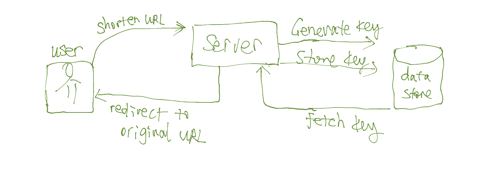
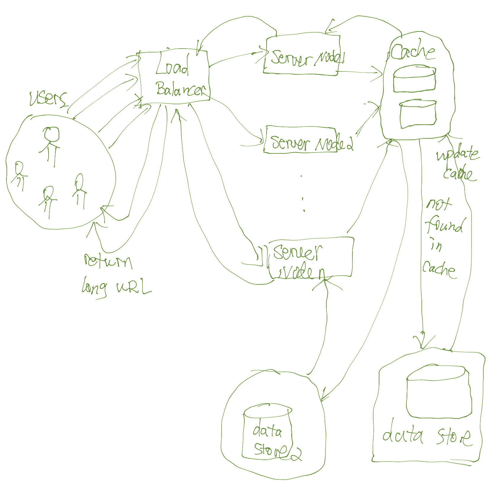

# URLShortener
This is the answer for the take home test. In general, the mandatory functions and most of the optional requirements have been implemented. 

I tested on my local host with the address http://127.0.0.1:8000/shorturl/\<str:url_key\>/, where `<str:url_key` is the shortened key for any original URL. For example,  `KaEjm4W` is the  an unique combination of 7 characters or digits (the `url_key` ) generated by a specified unique key generator; so when this key is mapped to the URL “https://www.django-rest-framework.org”, visiting “http://127.0.0.1:8000/shorturl/KaEjm4W” will redirect users to the original URL.

The following functions have been implemented:

- Shorten URLs
- Visiting the shortened URL will land on the original page
- Users can log in and see all past shortened URLs created by the user
- Users can customize the unique `url_key`. When a key is already in use, a message will prompt the user to try a new combination util a valid combination is provided

# Thought Process

The core idea behind this service is simple: we need a one-to-one mapping between a long URL and a shortened URL. 

To achieve this function, we need several components: 

1. A key generator that can generate unique keys with specified length; 
2. A set of data models for storing user data and matching to database tables (ORM);
3. A database for storing original and shortened URL key-value pairs; 
4. A GUI for users to enter a long URL; 
5. A set of views act as controllers for fetching the user input data, handing the data to different methods for processing, and eventually generate a HttpResponse.

If performance is a concern, we also need to address the potential issues such as:

- Shortened URL generation integrity and speed – this is largely affect by the key generation strategy we choose.

- URL redirection speed – this will be affected by the traffic and data read and write speed. 
- Service Robustness – this largely depends on the system up time, if we’re using only one server, a single point of failure will be a disastrous event. We also want to ensure the increase of the number of users using the service will not degrade the performance to a large degree. Even during peak loads, there should be an approximate maximum waiting time.
- To improve the robustness, one common solution is to use a distributed design, but this will complicates the key generation strategy and data integrity, as discussed further in the design section below.
- The ability to integrate with other systems – for more flexibility and decoupling, we could adopt a SOA (service oriented architecture) design, using REST APIs to expose different services, such as calling an REST API to get an unique key, although this might slow down the system a little bit since we’ll need to make a tremendous amounts of calls and it will be much slower than using a local key generator. 

With these functional requirements and non-functional concerns in mind, I’ll discuss the key generation strategy, the size of the storage needed for storing user data; traffic concerns, etc.

# Design

## Model

For a MVP (minimum viable product), I initial had two tables: a visitor table for storing user account information, and a ShortURL table for storing URL information, but I combined these two tables into one by using the `user_id` as an extra column in the ShortURL table. So, I only have one table `ShortURL` with the following fields:

`id` – the primary key of this table (in the future, it’s probably better to use the shortened url_key as the primary key since indexing the primary key might give us some performance improvement).

`url_key` – a permutation of letters and digits with a specified length.

`original_url` – this is the original long URL the user wants to convert to a shorter version.

`user_id` – this is the user who has an account and has logged in. For visitors, this field will be empty. If we want to see the history of a user’s shortened URLs, we’ll use this key to retrieve all the records for the user. The relationship between a user and a ShortURL table is one-to-many.

`created_time` – this is simply an extra information when the user used the service. We could use this to sort the list of shortened URLs.

## Template

The main page is the `base.html`, `customize_form.html`, and `generate_form.html`. `base.html` just defines the header and banner, as a basis for other templates to extend.

`url_history` displays a list of original URL and their shortened counterparts using the `user_id`.

 `customize_form.html` is the page for enter an URL and a customized `url_key`, which will be the 7-character long mixture of letters and digits. 

`generate_form.html` is similar except that it randomly generates a key, not allowing any user to change the key. 

These two features could be used for different types of users. For example, only user who has an account can customize the key.

## View

Mostly, I use function-based views; but I think using class-based views might be more readable.

Corresponding to the major templates discussed above, there are several functions handling each template, i.e., receiving a request with user input data, process the data (CRUP operations, validations, etc.), and returning a response to the template or redirecting to an external URL.

`user_url_history` is decorated with `@login_required`, so only user who has a `user_id` can see their conversion history.

`shorturl` takes a shortened URL and with `url_key` as a parameter. It use `url_key` to fetch the original URL and redirect the user to that URL.

`customize` and `generate` are corresponding to `customize_form.html` and `generate_form.html` templates, they handle form POSTs for creating a shortened URL.


## Performance 

### URL Key Length

Using base62 seems to be a popular choice, since it only uses letters (both uppercase and lowercase) and digits without any special characters. With 62 slots, we roughly get the following:

$62^6 \approx \ 56 \ billion \ URLs$

$62^7 \approx 3500 \ billion \ URLs$

With these numbers, the storage needed for storing these URLs will be huge:

```python
num_of_urls=3500 billion
active_urls_need_to_be_stored = around billions
bytes_each_record = may be around 500KB 

total_storage_needed = active_urls_need_to_be_stored * bytes_each_record
```

If using a distributed architecture, data need to be replicated to different clusters and nodes, so this number will be larger.

### Key Generation Algorithms

I used probably the simplest key generation strategy: from a pool of unique letters and digits, randomly select 7 of them and form a unique key. If this key is already in the table, re-generate one. The downside is the overhead of a lot of checking the table if the key already exists and re-select letters and digits to form a key.

With that said, an improvement could be using a Counter approach. We keep track of a global counter, every time a request is made, we increment the counter by 1. Then we cover this number to base62. There are also many downsides with this approach, such as race condition in a multithreaded setting, overflow of huge numbers, etc.

Another promising directions is to use some sort of stand alone off-line key generation service, so we store the key-value pairs in advance. When we need a pair, we just need to populate some records from the unused key-value table. This approach is also cache friendly and easy to apply in a distributed setting with load balancing since we could partition the table into different ranges and load certain range onto different nodes.


## Blueprint






